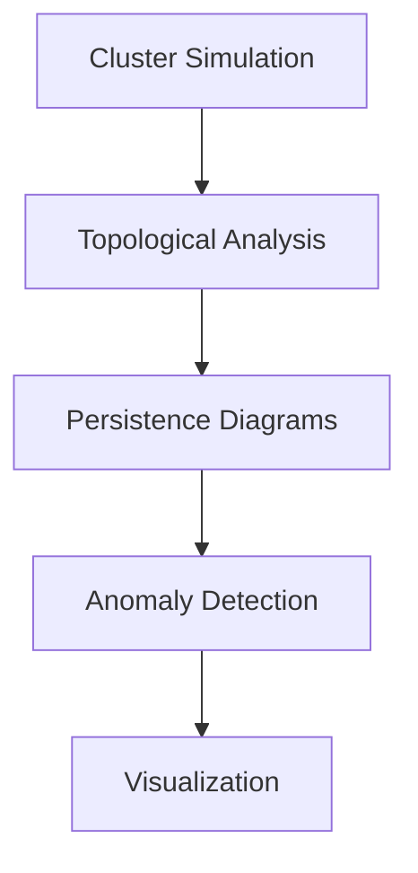

# TDAK System Architecture

:construction: This documentation is currently under construction. Consider it a placeholder for now.

## Overview


## Core Components
| Component          | Responsibility                          | Key Technologies       |
|--------------------|-----------------------------------------|------------------------|
| Cluster Simulator  | Generate synthetic node/metric data     | Python dataclasses     |
| Topology Engine    | Compute persistence diagrams            | Ripser, Scikit-TDA     |
| Analysis Module    | Compare topological signatures          | Wasserstein metrics    |
| Visualization      | Interactive diagram exploration         | Matplotlib, Persim     |

## Data Flow
1. **Input Generation**:
   ```python
   generator = ClusterGenerator(zones=3)
   nodes = generator.generate_cluster()
   ```

2. **Topological Processing**:
   ```python
   diagrams = compute_metric_persistence(nodes)
   ```

3. **Failure Analysis**:
   ```python
   report = analyze_changes(normal_diagrams, failed_diagrams)
   ```

## Design Decisions
1. **Topological vs Metric Approaches**  
   Why persistent homology outperforms threshold-based monitoring for network failures...

2. **Algorithm Choices**  
   Ripser for computational efficiency in high dimensions...

3. **Visual Tradeoffs**  
   Matplotlib selected for server-side rendering compatibility...